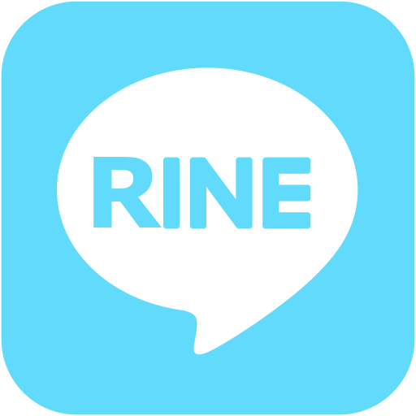

<p align="center">
  
</p>
<h1 align="center">
  RINE
</h1>
<h3 align="center">
  LINE modoki web application, written in ReactJS.
</h3>

## :rocket: Run

```
npm i
export REACT_APP_A3RT_TALK_API_KEY=$YOUR_A3RT_TALK_API_KEY
export REACT_APP_A3RT_IMAGE_SEARCH_API_KEY=$YOUR_A3RT_IMAGE_SEARCH_API_KEY
export REACT_APP_NOBY_API_KEY=$YOUR_NOBY_API_KEY

# Development
npm start
-> https://localhost:3000

# Production
npm run build
-> ./build
```

## :book: Technical Feature

- [Typescript](https://www.typescriptlang.org/)
- [React](https://reactjs.org/)
- [Create React App](https://create-react-app.dev/)
- [Redux Starter Kit](https://github.com/reduxjs/redux-starter-kit)
- [Redux Persist](https://github.com/rt2zz/redux-persist)
- [Connected React Router](https://github.com/supasate/connected-react-router)
- [styled-components](https://github.com/styled-components/styled-components)
- [Storybook](https://github.com/storybookjs/storybook)
- [Netlify](https://www.netlify.com/)
- [Atomic Design](http://atomicdesign.bradfrost.com/)
- [A3RT Talk API](https://a3rt.recruit-tech.co.jp/product/talkAPI/)
- [Noby API](https://webapi.cotogoto.ai/)

## :dizzy: Deploy

[](https://app.netlify.com/start/deploy?repository=https://github.com/cacarrot/RINE)
